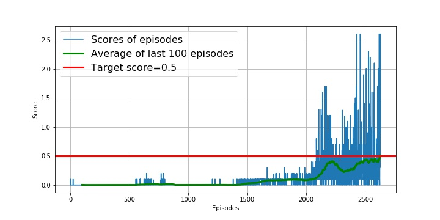

# Report

This file contains some clarification to the files `Tennis.ipynb` and `Report.html`.

If you didn't yet, please consult `README.md` to understand what's going on here.

## 1. The model and the training

I decided to use very slim models which consist of fully connected layers and a batch noramlizing layer only. Both **Actor** and **Critic** uses *ReLu* activation. As you can see in `Tennis.ipynb` **Actor** represents a policy based model and **Critic** represents a value based model.

To train the model I used a single instance of an **Agent** class that follows the need of the Unity Environmnet. The training process itself is based on the **Deep Deterministic Policy Gradient** method which is very new and popular nowadays. You can find additional stuff about it [here](https://arxiv.org/abs/1509.02971).

I used the hyperparameters:

```

BATCH_SIZE = 1024
BUFFER_SIZE = 1e5
GAMMA = 0.99
L2_WEIGHT_DECAY_FOR_CRITIC = 0
LEARNING_RATE_FOR_ACTOR = 2e-4
LEARNING_RATE_FOR_CRITIC = 1e-3
RANDOM_SEED = 12345
TAU = 1e-3

```

I prepared to keep the training even for *50'000* episodes but it took much shorter time.

## 2. Experiences and result

The whole training needed **2'632 episodes** totally till the average of last 100 scores went hihgher than the targetted **0.5**.

You can see how scores and the average changed in that figure below.



## 3. Conclusions

The performance of the model in the training seemed to be very hectic. It was like a roller-coaster. The figure in section `2.` well demonstrates this. On the other hand the goal of having `0.5` as a cummulated mean performance of the two player over 100 epoch doesn't mean that the agent plays perfectly, it just shows, it worths to teach further. At least by my opinion.

## 4. Improvement ideas

There are several ways to imporve the performance the code in this environment. I'll plan to implement all of them. And there is another similar environment to play with. I plan to code it as well.

### 4.1. Train for the 1.0 rule

I plan to train the same network untill the average of the last 100 episodes reaches **1.0**.

### 4.2. Soccer Challenge

I plan to solve the **Crawler Environment** too, where the goal is to train a team of agents to play soccer.


[source](https://user-images.githubusercontent.com/10624937/42135622-e55fb586-7d12-11e8-8a54-3c31da15a90a.gif)
